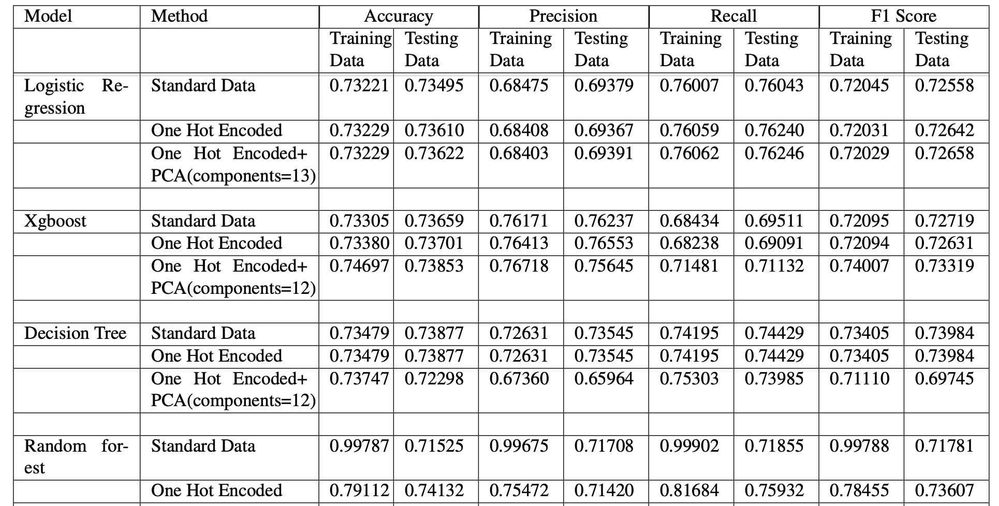

# Cardiovascular Disease Prediction using 4 Machine Learning Models</H1>

## 1. Overview
This study aims to develop a machine learning model for predicting cardiovascular diseases (CVD) using easily obtainable parameters like age, glucose levels, weight, and blood pressure. The goal is to facilitate early risk detection, enabling individuals to take preventive measures.

## 2. Model Used
Various classification models were trained on a cleaned and standardized dataset after outlier removal. Dimensionality reduction techniques, such as PCA, were employed to enhance model performance. The optimal PCA components and model hyperparameters were identified using K-Fold Cross Validation.

### 2.1 Logistic Regression
Logistic Regression is a statistical model that uses a logistic function to model a binary dependent variable. It estimates the probability that a given input point belongs to a certain class.

### 2.2 Decision Tree
A Decision Tree is a model that splits the data into subsets based on the value of input features. It creates a tree-like structure where each node represents a decision based on an attribute, and each branch represents the outcome of that decision.

### 2.3 Random Forest
Random Forest is an ensemble learning method that constructs multiple decision trees during training and outputs the mode of the classes (classification) or mean prediction (regression) of the individual trees.

### 2.4 XGBoost
XGBoost (Extreme Gradient Boosting) is an optimized gradient boosting machine learning algorithm. It uses a gradient descent algorithm to minimize the loss when adding new models.

## 3. Result

  

